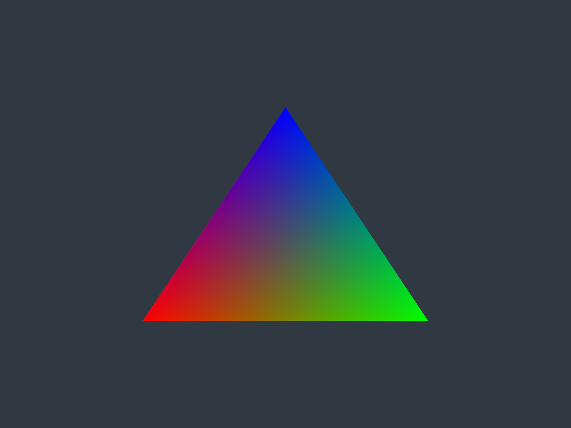
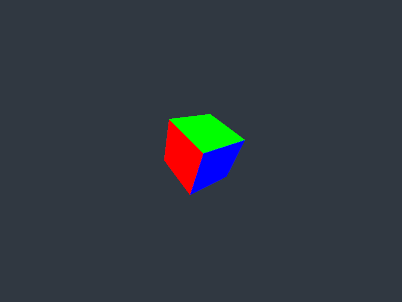
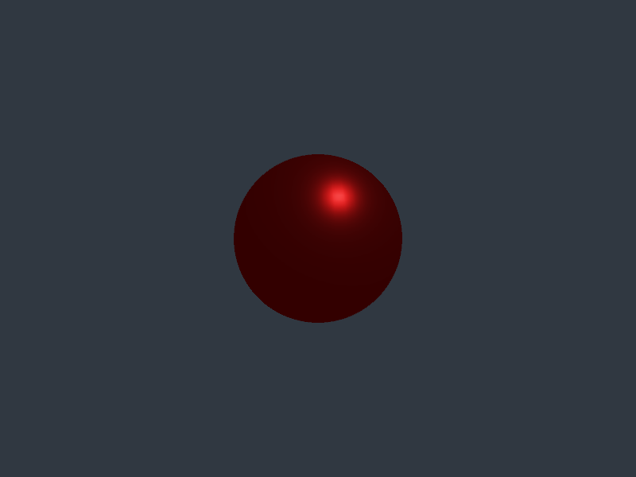
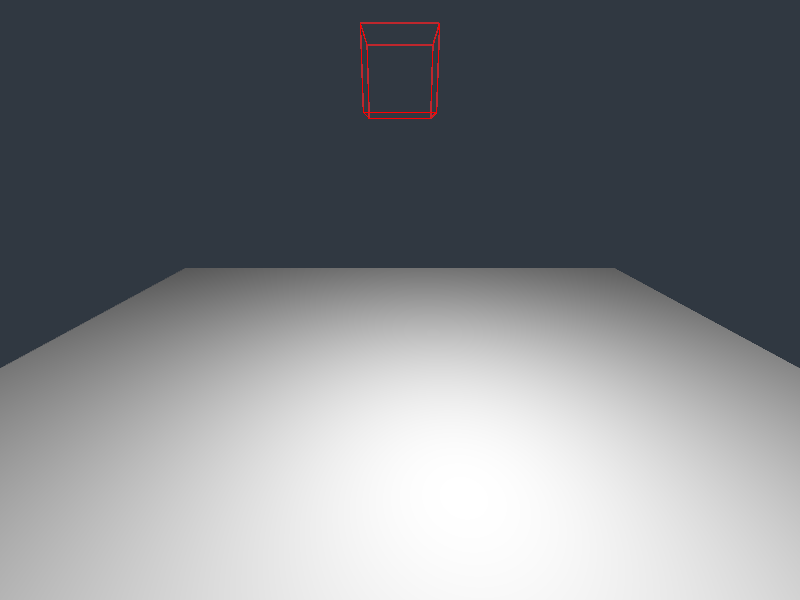

# 🔥 blaz

## Building

- [Install CMake >= 3.12](https://cmake.org/download/)
- ```git clone https://github.com/imadr/blaz.git```
- ```cd blaz```
- ```mkdir build```
- ```cmake -S . -B build``` or use cmake-gui
- Open the visual studio project or build with make

## Samples

<table border="0">
<tr>
  <td>
    <br>
    01-triangle
  </td>
  <td>
    <br>
    02-cubes
  </td> 
  <td>
    <br>
    03-pbr
  </td>
  <td>
    <br>
    04-physics
  </td>
</tr>
</table>
